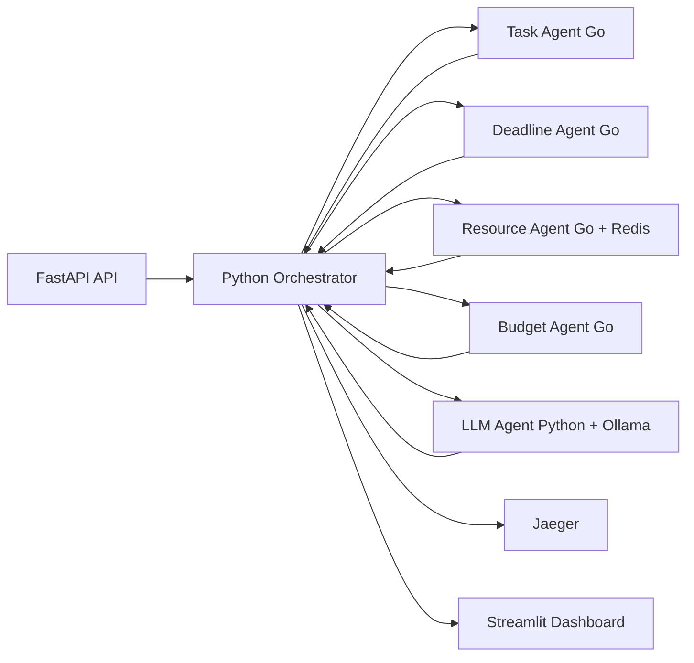

# Архитектура MAS (вариант 14)

```mermaid
flowchart LR
A[FastAPI API] --> O[Python Orchestrator]
O --> T[Task Agent Go]
O --> D[Deadline Agent Go]
O --> R[Resource Agent Go + Redis]
O --> B[Budget Agent Go]
O --> L[LLM Agent Python + Ollama]
T --> O
D --> O
R --> O
B --> O
L --> O
O --> J[Jaeger]
O --> UI[Streamlit Dashboard]
```
